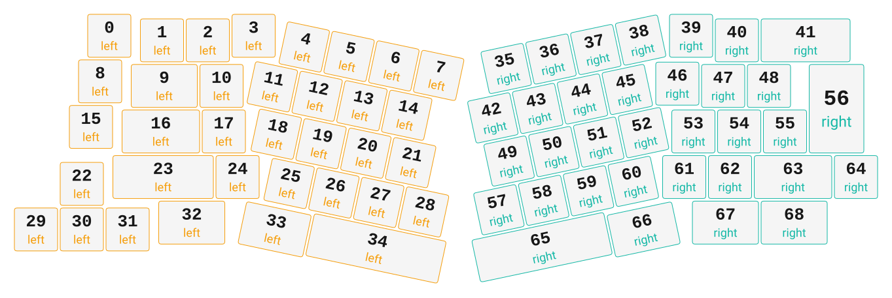

# ZMK Configuration for alice_split_iso

*Generated by Shield Wizard for ZMK*



Download compiled firmware from the Actions tab. <https://zmk.dev/docs/user-setup#installing-the-firmware>

Edit your keymap <https://zmk.dev/docs/keymaps>.
User keymap is located at [`config/alice_split_iso.keymap`](config/alice_split_iso.keymap).

-----

<details>
<summary>
Shield Wizard Debug Information
</summary>

In case of broken configuration, here is the Shield Wizard internal data used to generate this configuration:

Commit: 63ab9b7bd8845252979f45da72f40210b0b1a3ae

```json
{"name":"alice_split_iso","shield":"alice_split_iso","dongle":false,"modules":[],"layout":[{"id":"01KTKVPTDF37RFD8JK7Z5F7DM6","part":0,"row":0,"col":1,"w":1,"h":1,"x":1.55,"y":0.85,"r":0,"rx":0,"ry":0},{"id":"01KTKVPTDFVXVXW41NR0G60T7D","part":0,"row":0,"col":2,"w":1,"h":1,"x":2.7,"y":0.9500000000000001,"r":0,"rx":0,"ry":0},{"id":"01KTKVPTDG891T7YY6X5FF14HV","part":0,"row":0,"col":3,"w":1,"h":1,"x":3.7,"y":0.9500000000000001,"r":0,"rx":0,"ry":0},{"id":"01KTKVPTDF1R647JG91125BXVH","part":0,"row":0,"col":4,"w":1,"h":1,"x":4.699999999999999,"y":0.85,"r":0,"rx":0,"ry":0},{"id":"01KTKVPTDGS3H38ASB702M9VZ2","part":0,"row":0,"col":5,"w":1,"h":1,"x":6,"y":-0.2499999999999991,"r":12,"rx":0,"ry":0},{"id":"01KTKVPTDGDPKN8N5GRQFTTFXK","part":0,"row":0,"col":6,"w":1,"h":1,"x":7,"y":-0.2499999999999991,"r":12,"rx":0,"ry":0},{"id":"01KTKVPTDGAWSTB4S6F9P2GGA3","part":0,"row":0,"col":7,"w":1,"h":1,"x":8,"y":-0.2499999999999991,"r":12,"rx":0,"ry":0},{"id":"01KTKVPTDGKS5FZN99ED30E3DZ","part":0,"row":0,"col":8,"w":1,"h":1,"x":9,"y":-0.2499999999999991,"r":12,"rx":0,"ry":0},{"id":"01KTKVPTDGNWEMKBK4VBYPFGE0","part":0,"row":1,"col":1,"w":1,"h":1,"x":1.35,"y":1.85,"r":0,"rx":0,"ry":0},{"id":"01KTKVPTDG3YWSPSS8ERRVXN8T","part":0,"row":1,"col":2,"w":1.5,"h":1,"x":2.5,"y":1.9500000000000004,"r":0,"rx":0,"ry":0},{"id":"01KTKVPTDG0ACHG69803GY6JN2","part":0,"row":1,"col":3,"w":1,"h":1,"x":4,"y":1.9500000000000004,"r":0,"rx":0,"ry":0},{"id":"01KTKVPTDGH3XZRCHYVM28Z301","part":0,"row":1,"col":4,"w":1,"h":1,"x":5.5,"y":0.7500000000000009,"r":12,"rx":0,"ry":0},{"id":"01KTKVPTDGTR13N3VHKRHWR7J9","part":0,"row":1,"col":5,"w":1,"h":1,"x":6.5,"y":0.7500000000000009,"r":12,"rx":0,"ry":0},{"id":"01KTKVPTDG890HB6128BWA6HTC","part":0,"row":1,"col":6,"w":1,"h":1,"x":7.5,"y":0.7500000000000009,"r":12,"rx":0,"ry":0},{"id":"01KTKVPTDGJRMMC1BZA86C97AZ","part":0,"row":1,"col":7,"w":1,"h":1,"x":8.5,"y":0.7500000000000009,"r":12,"rx":0,"ry":0},{"id":"01KTKVPTDGEHGX0ZCVR90687DD","part":0,"row":2,"col":1,"w":1,"h":1,"x":1.15,"y":2.85,"r":0,"rx":0,"ry":0},{"id":"01KTKVPTDG65K2F5NGJFXMW8ES","part":0,"row":2,"col":2,"w":1.75,"h":1,"x":2.3,"y":2.95,"r":0,"rx":0,"ry":0},{"id":"01KTKVPTDGMN0W831JB3E13CGZ","part":0,"row":2,"col":3,"w":1,"h":1,"x":4.05,"y":2.95,"r":0,"rx":0,"ry":0},{"id":"01KTKVPTDG48MYA8EQTQ7MD494","part":0,"row":2,"col":4,"w":1,"h":1,"x":5.8,"y":1.7500000000000009,"r":12,"rx":0,"ry":0},{"id":"01KTKVPTDGZ7TDNR9MK45GJYG2","part":0,"row":2,"col":5,"w":1,"h":1,"x":6.8,"y":1.7500000000000009,"r":12,"rx":0,"ry":0},{"id":"01KTKVPTDG6B4T3R0Z40JBJM9G","part":0,"row":2,"col":6,"w":1,"h":1,"x":7.8,"y":1.7500000000000009,"r":12,"rx":0,"ry":0},{"id":"01KTKVPTDG08HZ0A7E4ZCF0PQY","part":0,"row":2,"col":7,"w":1,"h":1,"x":8.8,"y":1.7500000000000009,"r":12,"rx":0,"ry":0},{"id":"01KTKVPTDGQDVFWTVHG83NW0RP","part":0,"row":3,"col":1,"w":1,"h":1,"x":0.95,"y":4.1000000000000005,"r":0,"rx":0,"ry":0},{"id":"01KTKVPTDG7CPNJCBNECG7CC3H","part":0,"row":3,"col":2,"w":2.25,"h":1,"x":2.1,"y":3.95,"r":0,"rx":0,"ry":0},{"id":"01KTKVPTDGJ1A4M28QFBZHY4Z4","part":0,"row":3,"col":3,"w":1,"h":1,"x":4.35,"y":3.95,"r":0,"rx":0,"ry":0},{"id":"01KTKVPTDGC0S6FNWES4EQQ8WE","part":0,"row":3,"col":4,"w":1,"h":1,"x":6.3,"y":2.750000000000001,"r":12,"rx":0,"ry":0},{"id":"01KTKVPTDGCYD551CYWKX4H39W","part":0,"row":3,"col":5,"w":1,"h":1,"x":7.3,"y":2.750000000000001,"r":12,"rx":0,"ry":0},{"id":"01KTKVPTDG84MRNHPQAHKK3X59","part":0,"row":3,"col":6,"w":1,"h":1,"x":8.3,"y":2.750000000000001,"r":12,"rx":0,"ry":0},{"id":"01KTKVPTDHZFB6PA9KKVMTB78H","part":0,"row":3,"col":7,"w":1,"h":1,"x":9.3,"y":2.750000000000001,"r":12,"rx":0,"ry":0},{"id":"01KTKVPTDGMXBW74YTAQEXB9DR","part":0,"row":4,"col":0,"w":1,"h":1,"x":-0.05,"y":5.1000000000000005,"r":0,"rx":0,"ry":0},{"id":"01KTKVPTDG31Q14FBMWW6ZTNK6","part":0,"row":4,"col":1,"w":1,"h":1,"x":0.95,"y":5.1000000000000005,"r":0,"rx":0,"ry":0},{"id":"01KTKVPTDGBVJF48AGSXAMY2RP","part":0,"row":4,"col":2,"w":1,"h":1,"x":1.95,"y":5.1000000000000005,"r":0,"rx":0,"ry":0},{"id":"01KTKVPTDGTM57B5ABDS2202GR","part":0,"row":4,"col":3,"w":1.5,"h":1,"x":3.1,"y":4.95,"r":0,"rx":0,"ry":0},{"id":"01KTKVPTDH0AXVV0FCZD3CVKBM","part":0,"row":4,"col":4,"w":1.5,"h":1,"x":5.95,"y":3.8000000000000007,"r":12,"rx":0,"ry":0},{"id":"01KTKVPTDH1TQ0NBRTAX2T3W67","part":0,"row":4,"col":6,"w":3,"h":1,"x":7.45,"y":3.750000000000001,"r":12,"rx":0,"ry":0},{"id":"01KTKVPTDHMZ6W3CE2P1W8QACZ","part":1,"row":5,"col":0,"w":1,"h":1,"x":9.55,"y":3.750000000000001,"r":-12,"rx":0,"ry":0},{"id":"01KTKVPTDHAG51DSN44EXHQYN4","part":1,"row":5,"col":1,"w":1,"h":1,"x":10.55,"y":3.750000000000001,"r":-12,"rx":0,"ry":0},{"id":"01KTKVPTDHBY8BMP5KR38TBMEM","part":1,"row":5,"col":2,"w":1,"h":1,"x":11.55,"y":3.750000000000001,"r":-12,"rx":0,"ry":0},{"id":"01KTKVPTDH10AEVDE967S7FMAP","part":1,"row":5,"col":3,"w":1,"h":1,"x":12.55,"y":3.750000000000001,"r":-12,"rx":0,"ry":0},{"id":"01KTKVPTDFKNJ41CQ510R27189","part":1,"row":5,"col":4,"w":1,"h":1,"x":14.25,"y":0.85,"r":0,"rx":0,"ry":0},{"id":"01KTKVPTDGKT8BD42Q2GPKP4GB","part":1,"row":5,"col":5,"w":1,"h":1,"x":15.25,"y":0.9500000000000001,"r":0,"rx":0,"ry":0},{"id":"01KTKVPTDGZYY0Y8HDWQTR4CVR","part":1,"row":5,"col":6,"w":2,"h":1,"x":16.25,"y":0.9500000000000001,"r":0,"rx":0,"ry":0},{"id":"01KTKVPTDHW0GWXJ92EFDCKZE5","part":1,"row":6,"col":0,"w":1,"h":1,"x":9.04,"y":4.750000000000001,"r":-12,"rx":0,"ry":0},{"id":"01KTKVPTDHMZ1K3HEKRAA3WJGY","part":1,"row":6,"col":1,"w":1,"h":1,"x":10.04,"y":4.750000000000001,"r":-12,"rx":0,"ry":0},{"id":"01KTKVPTDHXZ0APFJCF3YA83BM","part":1,"row":6,"col":2,"w":1,"h":1,"x":11.04,"y":4.750000000000001,"r":-12,"rx":0,"ry":0},{"id":"01KTKVPTDHTJ68YERKWRR6S98D","part":1,"row":6,"col":3,"w":1,"h":1,"x":12.04,"y":4.750000000000001,"r":-12,"rx":0,"ry":0},{"id":"01KTKVPTDGS1MR4H3PNGM59SH2","part":1,"row":6,"col":4,"w":1,"h":1,"x":13.95,"y":1.9000000000000001,"r":0,"rx":0,"ry":0},{"id":"01KTKVPTDG79T66NS4RKRGKJ0J","part":1,"row":6,"col":5,"w":1,"h":1,"x":14.95,"y":1.9500000000000004,"r":0,"rx":0,"ry":0},{"id":"01KTKVPTDG7JACFNJMJDH8X6V6","part":1,"row":6,"col":6,"w":1,"h":1,"x":15.95,"y":1.9500000000000004,"r":0,"rx":0,"ry":0},{"id":"01KTKVPTDHBZCDSTBYYPAHYW5W","part":1,"row":7,"col":0,"w":1,"h":1,"x":9.19,"y":5.750000000000001,"r":-12,"rx":0,"ry":0},{"id":"01KTKVPTDHD6PQGWXBKDJAME6K","part":1,"row":7,"col":1,"w":1,"h":1,"x":10.19,"y":5.750000000000001,"r":-12,"rx":0,"ry":0},{"id":"01KTKVPTDHMYAKT7G7ESMT3B34","part":1,"row":7,"col":2,"w":1,"h":1,"x":11.19,"y":5.750000000000001,"r":-12,"rx":0,"ry":0},{"id":"01KTKVPTDHCE7FS8KJJNSEXQEF","part":1,"row":7,"col":3,"w":1,"h":1,"x":12.19,"y":5.750000000000001,"r":-12,"rx":0,"ry":0},{"id":"01KTKVPTDG3VG2AJXJ6S17P3AH","part":1,"row":7,"col":4,"w":1,"h":1,"x":14.3,"y":2.95,"r":0,"rx":0,"ry":0},{"id":"01KTKVPTDG417J165PN7AXFQCP","part":1,"row":7,"col":5,"w":1,"h":1,"x":15.3,"y":2.95,"r":0,"rx":0,"ry":0},{"id":"01KTKVPTDGHE815VS2BDPV4H4A","part":1,"row":7,"col":6,"w":1,"h":1,"x":16.3,"y":2.95,"r":0,"rx":0,"ry":0},{"id":"01KTKVPTDGYGE745QCRSW0JMPR","part":1,"row":7,"col":7,"w":1.25,"h":2,"x":17.3,"y":1.9500000000000004,"r":0,"rx":0,"ry":0},{"id":"01KTKVPTDHKCQA8SJAGHFK7A28","part":1,"row":8,"col":0,"w":1,"h":1,"x":8.75,"y":6.750000000000001,"r":-12,"rx":0,"ry":0},{"id":"01KTKVPTDHE426G14B79KDQZJS","part":1,"row":8,"col":1,"w":1,"h":1,"x":9.75,"y":6.750000000000001,"r":-12,"rx":0,"ry":0},{"id":"01KTKVPTDHB6ZW3DAZTXSZN8DF","part":1,"row":8,"col":2,"w":1,"h":1,"x":10.75,"y":6.750000000000001,"r":-12,"rx":0,"ry":0},{"id":"01KTKVPTDH55214D08VBM7AS1J","part":1,"row":8,"col":3,"w":1,"h":1,"x":11.75,"y":6.750000000000001,"r":-12,"rx":0,"ry":0},{"id":"01KTKVPTDGK53YGWP8A7EJKRGV","part":1,"row":8,"col":4,"w":1,"h":1,"x":14.1,"y":3.95,"r":0,"rx":0,"ry":0},{"id":"01KTKVPTDGN99ASP8JB9TV3PRT","part":1,"row":8,"col":5,"w":1,"h":1,"x":15.1,"y":3.95,"r":0,"rx":0,"ry":0},{"id":"01KTKVPTDG95750V2YJMS97QAJ","part":1,"row":8,"col":6,"w":1.75,"h":1,"x":16.1,"y":3.95,"r":0,"rx":0,"ry":0},{"id":"01KTKVPTDGZKX99AYSCSJ2R5RP","part":1,"row":8,"col":7,"w":1,"h":1,"x":17.85,"y":3.95,"r":0,"rx":0,"ry":0},{"id":"01KTKVPTDHBEPQD7WKZSFVHY8C","part":1,"row":9,"col":1,"w":3,"h":1,"x":8.5,"y":7.750000000000001,"r":-12,"rx":0,"ry":0},{"id":"01KTKVPTDHAHZBQTEAH0RVEK3H","part":1,"row":9,"col":3,"w":1.5,"h":1,"x":11.5,"y":7.83,"r":-12,"rx":0,"ry":0},{"id":"01KTKVPTDGX2ENZV7YAX6N2B6X","part":1,"row":9,"col":5,"w":1.5,"h":1,"x":14.75,"y":4.95,"r":0,"rx":0,"ry":0},{"id":"01KTKVPTDGW1AXQRVA0STMFWVY","part":1,"row":9,"col":6,"w":1.5,"h":1,"x":16.25,"y":4.95,"r":0,"rx":0,"ry":0}],"parts":[{"name":"left","controller":"nice_nano_v2","wiring":"matrix_diode","pins":{"d6":"output","d2":"output","d8":"output","d9":"output","d18":"output","d7":"input","d21":"input","d15":"input","d14":"input","d5":"input","d16":"input","d10":"input","d20":"input","d19":"input"},"keys":{"01KTKVPTDGMXBW74YTAQEXB9DR":{"input":"d7","output":"d6"},"01KTKVPTDG31Q14FBMWW6ZTNK6":{"input":"d21","output":"d6"},"01KTKVPTDGBVJF48AGSXAMY2RP":{"input":"d15","output":"d6"},"01KTKVPTDGTM57B5ABDS2202GR":{"input":"d14","output":"d6"},"01KTKVPTDH0AXVV0FCZD3CVKBM":{"input":"d5","output":"d6"},"01KTKVPTDH1TQ0NBRTAX2T3W67":{"input":"d10","output":"d6"},"01KTKVPTDGQDVFWTVHG83NW0RP":{"input":"d21","output":"d2"},"01KTKVPTDG7CPNJCBNECG7CC3H":{"input":"d15","output":"d2"},"01KTKVPTDGJ1A4M28QFBZHY4Z4":{"input":"d14","output":"d2"},"01KTKVPTDGC0S6FNWES4EQQ8WE":{"input":"d5","output":"d2"},"01KTKVPTDGCYD551CYWKX4H39W":{"input":"d16","output":"d2"},"01KTKVPTDG84MRNHPQAHKK3X59":{"input":"d10","output":"d2"},"01KTKVPTDHZFB6PA9KKVMTB78H":{"input":"d20","output":"d2"},"01KTKVPTDGNWEMKBK4VBYPFGE0":{"input":"d21","output":"d8"},"01KTKVPTDG3YWSPSS8ERRVXN8T":{"input":"d15","output":"d8"},"01KTKVPTDGH3XZRCHYVM28Z301":{"input":"d5","output":"d8"},"01KTKVPTDGTR13N3VHKRHWR7J9":{"input":"d16","output":"d8"},"01KTKVPTDG890HB6128BWA6HTC":{"input":"d10","output":"d8"},"01KTKVPTDGJRMMC1BZA86C97AZ":{"input":"d20","output":"d8"},"01KTKVPTDGEHGX0ZCVR90687DD":{"input":"d21","output":"d9"},"01KTKVPTDG65K2F5NGJFXMW8ES":{"input":"d15","output":"d9"},"01KTKVPTDGMN0W831JB3E13CGZ":{"input":"d14","output":"d9"},"01KTKVPTDG48MYA8EQTQ7MD494":{"input":"d5","output":"d9"},"01KTKVPTDGZ7TDNR9MK45GJYG2":{"input":"d16","output":"d9"},"01KTKVPTDG6B4T3R0Z40JBJM9G":{"input":"d10","output":"d9"},"01KTKVPTDG08HZ0A7E4ZCF0PQY":{"input":"d20","output":"d9"},"01KTKVPTDF37RFD8JK7Z5F7DM6":{"input":"d21","output":"d18"},"01KTKVPTDFVXVXW41NR0G60T7D":{"input":"d15","output":"d18"},"01KTKVPTDF1R647JG91125BXVH":{"input":"d5","output":"d18"},"01KTKVPTDGS3H38ASB702M9VZ2":{"input":"d16","output":"d18"},"01KTKVPTDGDPKN8N5GRQFTTFXK":{"input":"d10","output":"d18"},"01KTKVPTDGAWSTB4S6F9P2GGA3":{"input":"d20","output":"d18"},"01KTKVPTDGKS5FZN99ED30E3DZ":{"input":"d19","output":"d18"},"01KTKVPTDG891T7YY6X5FF14HV":{"input":"d14","output":"d18"},"01KTKVPTDG0ACHG69803GY6JN2":{"input":"d14","output":"d8"}},"encoders":[],"buses":[{"name":"spi0","devices":[],"type":"spi"},{"name":"spi1","devices":[],"type":"spi"},{"name":"spi2","devices":[],"type":"spi"},{"name":"spi3","devices":[],"type":"spi"},{"name":"i2c0","devices":[],"type":"i2c"},{"name":"i2c1","devices":[],"type":"i2c"}]},{"name":"right","controller":"nice_nano_v2","wiring":"matrix_diode","pins":{"d21":"output","d4":"output","d5":"output","d10":"output","d16":"output","d1":"input","d0":"input","d2":"input","d3":"input","d20":"input","d19":"input","d14":"input","d15":"input"},"keys":{"01KTKVPTDHMZ6W3CE2P1W8QACZ":{"input":"d1","output":"d21"},"01KTKVPTDHAG51DSN44EXHQYN4":{"input":"d0","output":"d21"},"01KTKVPTDHBY8BMP5KR38TBMEM":{"input":"d2","output":"d21"},"01KTKVPTDH10AEVDE967S7FMAP":{"input":"d3","output":"d21"},"01KTKVPTDFKNJ41CQ510R27189":{"input":"d20","output":"d21"},"01KTKVPTDGKT8BD42Q2GPKP4GB":{"input":"d19","output":"d21"},"01KTKVPTDGZYY0Y8HDWQTR4CVR":{"input":"d14","output":"d21"},"01KTKVPTDHW0GWXJ92EFDCKZE5":{"input":"d1","output":"d4"},"01KTKVPTDHMZ1K3HEKRAA3WJGY":{"input":"d0","output":"d4"},"01KTKVPTDHXZ0APFJCF3YA83BM":{"input":"d2","output":"d4"},"01KTKVPTDHTJ68YERKWRR6S98D":{"input":"d3","output":"d4"},"01KTKVPTDGS1MR4H3PNGM59SH2":{"input":"d20","output":"d4"},"01KTKVPTDG79T66NS4RKRGKJ0J":{"input":"d19","output":"d4"},"01KTKVPTDG7JACFNJMJDH8X6V6":{"input":"d14","output":"d4"},"01KTKVPTDHBZCDSTBYYPAHYW5W":{"input":"d1","output":"d5"},"01KTKVPTDHD6PQGWXBKDJAME6K":{"input":"d0","output":"d5"},"01KTKVPTDHMYAKT7G7ESMT3B34":{"input":"d2","output":"d5"},"01KTKVPTDHCE7FS8KJJNSEXQEF":{"input":"d3","output":"d5"},"01KTKVPTDG3VG2AJXJ6S17P3AH":{"input":"d20","output":"d5"},"01KTKVPTDG417J165PN7AXFQCP":{"input":"d19","output":"d5"},"01KTKVPTDGHE815VS2BDPV4H4A":{"input":"d14","output":"d5"},"01KTKVPTDGYGE745QCRSW0JMPR":{"input":"d15","output":"d5"},"01KTKVPTDHKCQA8SJAGHFK7A28":{"input":"d1","output":"d10"},"01KTKVPTDHE426G14B79KDQZJS":{"input":"d0","output":"d10"},"01KTKVPTDHB6ZW3DAZTXSZN8DF":{"input":"d2","output":"d10"},"01KTKVPTDH55214D08VBM7AS1J":{"input":"d3","output":"d10"},"01KTKVPTDGK53YGWP8A7EJKRGV":{"input":"d20","output":"d10"},"01KTKVPTDGN99ASP8JB9TV3PRT":{"input":"d19","output":"d10"},"01KTKVPTDG95750V2YJMS97QAJ":{"input":"d14","output":"d10"},"01KTKVPTDGZKX99AYSCSJ2R5RP":{"input":"d15","output":"d10"},"01KTKVPTDHBEPQD7WKZSFVHY8C":{"input":"d0","output":"d16"},"01KTKVPTDHAHZBQTEAH0RVEK3H":{"input":"d3","output":"d16"},"01KTKVPTDGX2ENZV7YAX6N2B6X":{"input":"d19","output":"d16"},"01KTKVPTDGW1AXQRVA0STMFWVY":{"input":"d14","output":"d16"}},"encoders":[],"buses":[{"name":"spi0","devices":[],"type":"spi"},{"name":"spi1","devices":[],"type":"spi"},{"name":"spi2","devices":[],"type":"spi"},{"name":"spi3","devices":[],"type":"spi"},{"name":"i2c0","devices":[],"type":"i2c"},{"name":"i2c1","devices":[],"type":"i2c"}]}]}
```

</details>
